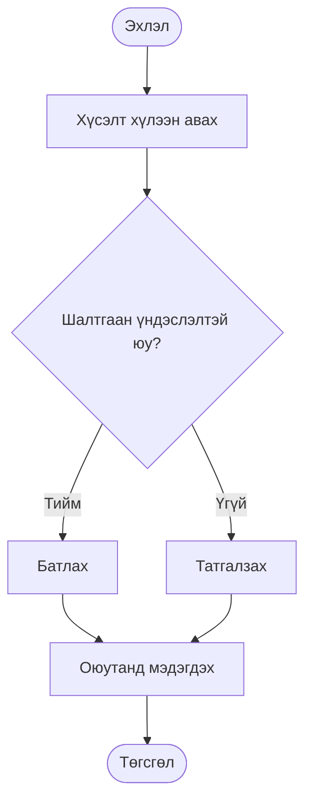

# Бизнесийн процесс

**Бизнесийн процесс** (Business Process) гэдэг нь тодорхой
**оролт** (input)-с эхлэн, тодорхой **гаралт** (output) буюу
үр дүнд хүргэдэг, дэс дараалал бүхий үйл ажиллагааны цогц юм.

> Өөрөөр хэлбэл, *"Хэн, юуг, ямар дарааллаар, ямар үр дүнтэйгээр хийдэг вэ?"*
> гэсэн асуултын хариултыг бүтэцтэйгээр тодорхойлдог.

**Процессын жишээ:**

| Оролт | Процесс | Гаралт |
|---|---|---|
| Оюутны элсэлтийн өргөдөл | Хүлээн авах → Шалгах → Бүртгэх → Мэдэгдэх | Бүртгэгдсэн оюутан |
| Багшийн хичээлийн төлөвлөгөө | Хянах → Батлах → Системд оруулах | Батлагдсан хөтөлбөр |
| Санхүүгийн тайлан | Нэгтгэх → Шалгах → Батлах → Илгээх | Батлагдсан тайлан |

---

## Бизнесийн процессыг хэрхэн таних вэ?

Процессыг тодорхойлохдоо дараах 5 асуултыг тавих нь хамгийн үр дүнтэй арга юм.

| Асуулт | Тайлбар | Процессын жишээ |
|---|---|---|
| **Юу** хийгдэж байна вэ? | Процессын нэр, зорилго | Оюутны дүн бүртгэх |
| **Хэн** хийдэг вэ? | Хариуцагч, оролцогч | Багш, тэнхимийн нарийн бичиг |
| **Хэрхэн** хийдэг вэ? | Үе шат, дараалал | Дүн оруулах → Шалгах → Баталгаажуулах |
| **Хэзээ** хийдэг вэ? | Цаг хугацаа, давтамж | Улирал бүрийн төгсгөлд |
| **Юу** гардаг вэ? | Үр дүн, гаралт | Баталгаажсан дүнгийн жагсаалт |

### Процесс мөн эсэхийг шалгах

Дараах 3 нөхцөл бүгд хангагдаж байвал тухайн үйл ажиллагаа
нь процесс мөн.

- **Давтагддаг** — Нэг удаагийн ажил биш, тогтмол явагддаг байх.
- **Хэмжигддэг** — Үр дүнг тоо болон чанараар илэрхийлж болдог байх.
- **Сайжруулж болдог** — Процесст өөрчлөлт оруулахад үр дүн нь дээшилдэг байх.

---

## Бизнесийн процессыг дүрслэх аргууд

Процессыг дүрслэх үндсэн 3 арга байдаг. Зорилго болон
нарийвчлалын түвшнээс хамааран тохирох аргыг сонгоно.

### 1. Урсгалын диаграм (Flowchart)

Хамгийн өргөн хэрэглэгддэг энгийн хэлбэр. Үйл ажиллагааны
дарааллыг стандарт дүрс тэмдэгт ашиглан харуулдаг.

| Дүрс | Утга |
|---|---|
| Зуйван `( )` | Эхлэл ба Төгсгөл |
| Тэгш өнцөгт `[ ]` | Үйл ажиллагаа, алхам |
| Ромб `< >` | Шийдвэр гаргах цэг (Тийм / Үгүй) |
| Сум `→` | Урсгал чиглэл |

**Хэзээ ашиглах вэ:** Нэг нэгж эсвэл хэлтсийн дотоод
процессыг тайлбарлахад тохиромжтой.

**Жишээ — Оюутанд чөлөө олгох процесс:**
```
( Эхлэл )
    ↓
[ Хүсэлт хүлээн авах ]
    ↓
< Шалтгаан үндэслэлтэй юу? >
    ↓ Тийм              ↓ Үгүй
[ Батлах ]          [ Татгалзах ]
    ↓                    ↓
[ Оюутанд мэдэгдэх — баталсан / татгалзсан ]
    ↓
( Төгсгөл )
```

Дээрх процессыг урсгалын диаграмаар дор дүрслэв.




### 2. Үүргийн зааглалын (Swim Lane) диаграм

Оролцогчдын үүргийг тусдаа зурваст зааглан харуулдаг урсгалын диаграмын өргөтгөсөн хувилбар. "Swim lane" буюу
"усан бассейны зурвас" гэдэг нь зурвас бүр нэг оролцогчийг илэрхийлдэгтэй холбоотой юм.

**Хэзээ ашиглах вэ:** Хэд хэдэн хэлтэс, албан тушаалтан
хамтран оролцдог нарийн төвөгтэй процессыг дүрслэхэд ашиглана.

**Жишээ — Дотоод захиалгын процесс:**
```
[Ажилтан   ]  Захиалга үүсгэх →
[Менежер   ]                     Хянах → Батлах →
[Санхүү    ]                                      Төлбөр баталгаажуулах →
[Нийлүүлэгч]                                                               Хүргэлт
```


### 3. BPMN диаграм

**BPMN** (Business Process Model and Notation) нь бизнесийн
процессыг дүрслэх олон улсын стандарт (ISO 19510) тэмдэглэгээний систем. Урсгалын диаграмаас илүү нарийвчлалтай тул программ хангамж болон системийн хөгжүүлэлттэй шууд холбогддог.

**Хэзээ ашиглах вэ:** Процессыг цахимжуулах, стандартчилах, автоматжуулах болон аудит хийхэд ашиглана.

**Хэрэгсэл:** [draw.io](https://www.drawio.com) (үнэгүй),
Bizagi, Lucidchart.


### Аргуудын харьцуулалт

| Шинж | Flowchart | Swim Lane | BPMN |
|---|---|---|---|
| **Хялбар байдал** | ✅ Маш хялбар | ✅ Хялбар | ⚠️ Мэргэжлийн |
| **Оролцогчдын тоо** | 1-2 | 2–10 | Хязгааргүй |
| **Стандарт** | Нийтлэг | Нийтлэг | ISO 19510 |
| **Зориулалт** | Ерөнхий тайлбар | Үүрэг зааглах | Стандартчилах |

---

## ШУТИС-д хэрэглэх зөвлөмж

Дижитал шилжилтийн хүрээнд процессыг дүрслэхдээ дараах
гурван шатыг мөрдлөгө болгоно.

- **Ойлгох (Manual):** Урсгалын диаграм ашиглан процессын эхлэл, төгсгөл, шийдвэрийн цэгүүдийг тодорхойлох.
- **Зааглах (Structure):** Swim Lane ашиглаж нэгж хоорондын үүрэг хариуцлагыг тодорхой болгох.
- **Цахимжуулах (Standardize):** BPMN ашиглаж процессыг системд суулгах, автоматжуулахад бэлтгэх.

> ✨ **Алтан дүрэм:** Процессыг дүрслэхийн өмнө тухайн
> ажлыг өдөр тутам гүйцэтгэдэг хүнтэй урьдчилан зөвлөлдөх нь чухал. Диаграм нь санаа зорилгыг бус,
> **бодит байдлыг** тусгасан байх ёстой.

---

## ✅ Өөрийгөө шалгах

*Та өөрийн хариуцдаг ажлын процессыг ойлгож байна уу?*

- [ ] Би өөрийн хариуцдаг ажлын эхлэл, төгсгөл, дарааллыг
  тодорхойлж чаддаг.
- [ ] Би нэг процесст хэн оролцож, хэн эцсийн хариуцлагыг хүлээдэг болохыг
  мэддэг.
- [ ] Би алдаа гарах үед процессын аль алхамд гарсныг илрүүлж
  чаддаг.
- [ ] Би процессын сайжруулалтыг санал болгохдоо бодит өгөгдөл,
  нотолгоонд суурилдаг.

---

> **Санамж:** Процессыг дүрслэх нь зөвхөн диаграм зурах ажил
> биш юм. Энэ нь байгууллагын мэдлэгийг хувь хүнээс тогтолцоо
> руу шилжүүлэх үйл явц болно.

---

## Эх сурвалж

1. [BPMN стандарт — Object Management Group](https://www.omg.org/bpmn/)
2. [ISO 19510:2013 — BPMN](https://www.iso.org/standard/62652.html)
3. [draw.io — Үнэгүй диаграм хийх хэрэгсэл](https://www.drawio.com)
4. [Чанарын удирдлага — dx.must.edu.mn](https://dx.must.edu.mn/news/iso-standard.html)
5. [PDCA мөчлөг — dx.must.edu.mn](https://dx.must.edu.mn/news/term-pdca.html)
